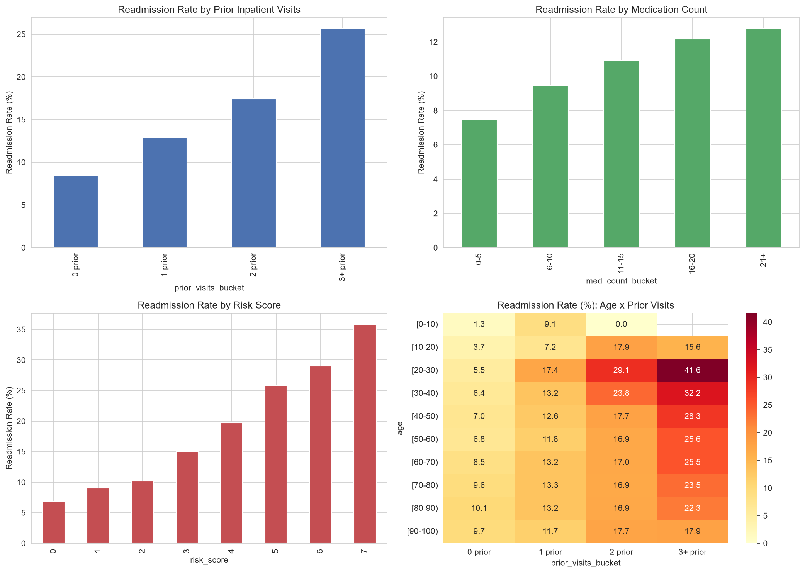

# Diabetic Patient Readmission Risk Analysis

A pandas-driven analysis of 30-day hospital readmission patterns in diabetic patients using real-world EHR data. The project investigates which patient, utilization, and clinical factors are most strongly associated with 30-day readmission and uses these findings to develop an exploratory, transparent, rule-based risk-scoring system — without machine learning.

## Executive Summary

Analyzed 101,766 hospital encounters (UCI Diabetes 130-US Hospitals dataset) to find what's associated with 30-day readmission in diabetic patients — using only pandas, no ML. **Prior inpatient visits was the strongest single factor**: patients with 3+ prior visits were readmitted at 3x the rate of first-time patients (25.7% vs 8.4%). A deeper cross-tab revealed this effect is nearly **2.3x stronger in patients aged 20–30 than in patients 90+**, a pattern invisible in single-variable analysis. These findings were combined into a transparent, hand-built risk score (0–7) that separated patients into groups readmitted at 6.9% to 35.9% of the time — over a 5x spread — using fully interpretable rules, not a black box. Full methodology, confidence intervals, and limitations in [`docs/methodology.md`](docs/methodology.md).

## Problem

Hospital readmissions within 30 days are an important healthcare quality and cost concern in the United States and are addressed through programs such as the CMS Hospital Readmissions Reduction Program.

This project asks:

* Which patient, utilization, and clinical factors show the strongest observed association with higher 30-day readmission rates among diabetic patients?
* How do combinations of factors affect observed readmission rates?
* Can descriptive analysis be used to identify patient segments with comparatively higher observed readmission rates?
* Can these findings be translated into a transparent, rule-based risk score?

The analysis is designed to demonstrate practical healthcare data analysis using Python and pandas rather than machine-learning prediction.

## Dataset

* **Source:** [Diabetes 130-US Hospitals for Years 1999–2008](https://archive.ics.uci.edu/dataset/296/diabetes+130-us+hospitals+for+years+1999-2008) — UCI Machine Learning Repository
* **Size:** 101,766 hospital encounters (71,518 unique patients)
* **Features:** 50 original variables
* **Time period:** 1999–2008

The dataset contains demographics, admission/discharge details, prior inpatient/emergency/outpatient visit counts, length of stay, ICD-9 diagnosis codes, lab procedures, medications, and readmission outcome.

Encounters (101,766) exceed unique patients (71,518) because roughly 30,000 patients had more than one hospital visit in the dataset. Analysis is conducted at the **encounter level**, matching how hospitals track readmissions in practice.

The raw dataset is downloaded programmatically at the start of the notebook (see [How to Run](#how-to-run)) and is not stored in this repository.

### 30-Day Readmission Definition

The dataset's `readmitted` column contains three values: `<30`, `>30`, `NO`. A binary column, `readmitted_30d`, was derived:

```text
1 → readmitted == "<30"
0 → readmitted == ">30" or "NO"
```

**Class balance:** 11,357 encounters readmitted within 30 days (11.2%) vs. 90,409 not (88.8%) — an imbalanced target, accounted for throughout when interpreting relative rate comparisons.

## Tech Stack

* **Python 3.x**
* **pandas** — data cleaning, transformation, grouping and analysis
* **NumPy** — numerical operations
* **Matplotlib / Seaborn** — data visualization
* **openpyxl** — Excel report generation
* **Jupyter (via VS Code)** — exploratory analysis

## Repository Structure

```text
healthcare-readmission-analysis/
│
├── analysis.ipynb              # Main analysis notebook
├── data_quality_report.md      # Cleaning decisions and rationale
├── requirements.txt
├── outputs/
│   ├── key_findings.png        # Combined 4-panel figure
│   └── readmission_analysis_summary.xlsx
├── docs/
│   └── methodology.md          # Full methodology, assumptions, and limitations
└── README.md
```

## Methodology

### 1. Data Profiling and Cleaning
Assessed missingness (the dataset uses `"?"` as a placeholder rather than true nulls), dropped columns missing ~70%+ of values (`weight`, `payer_code`), and filled smaller gaps with `"Unknown"` (`medical_specialty`, `race`, `diag_1/2/3`) to preserve rows. Full rationale and exact percentages are documented in `data_quality_report.md`.

### 2. Readmission Outcome Construction
Built the binary `readmitted_30d` target described above.

### 3. Clinical Diagnosis Recoding
Mapped raw ICD-9 codes in `diag_1`, `diag_2`, `diag_3` into readable clinical categories (Circulatory, Respiratory, Digestive, Diabetes, Genitourinary, Injury, Musculoskeletal, Neoplasms, Supplemental, External causes, Other) using standard ICD-9 range groupings.

### 4. Readmission Rate Analysis
Used `groupby()` to compare 30-day readmission rates across age, prior inpatient visits, and medication count.

### 5. Multi-Variable Analysis
Used `pivot_table()` to cross-tabulate age × prior inpatient visits, revealing an interaction effect not visible in either variable alone (see Key Findings).

### 6. Exploratory Rule-Based Risk Score

A transparent, weighted scoring system (0–7 points) was built directly from the groupby/pivot findings in Steps 4–5. Every rule and weight below was chosen by hand based on where the observed readmission rate rose most sharply in the tables — there is no fitted model behind it.

**Scoring rules:**

| Factor | Condition | Points |
|---|---|---|
| Prior inpatient visits | 3+ prior | +3 |
| | 2 prior | +2 |
| | 1 prior | +1 |
| | 0 prior | +0 |
| Medication count | 16–20 or 21+ | +2 |
| | 11–15 | +1 |
| | 0–5 or 6–10 | +0 |
| Age × prior visits interaction | Age 20–30 or 30–40 **and** 2+ or 3+ prior visits | +2 |
| | Otherwise | +0 |

Maximum possible score: 3 + 2 + 2 = 7.

**Threshold rationale:** the prior-visits weights (0/1/2/3) mirror the four buckets used in the groupby analysis directly, since that variable showed the largest rate spread (8.44% → 25.66%). The medication weights collapse five buckets into three point-tiers, breaking at 11 and 16 medications — the two points in the original groupby table where the rate visibly stepped up. The age-interaction bonus reflects Finding 3 specifically: it only applies to the two age brackets (20–30, 30–40) where the interaction with prior visits was strongest, so as not to overstate an effect that was much weaker at other ages.

**Validation, and why it's exploratory rather than confirmatory:** the score was checked by grouping encounters by score and confirming the readmission rate rose monotonically (6.88% → 35.86%, see Risk Segments below). This is **not out-of-sample validation** — the score's rules were derived from patterns in this dataset, and it was then checked for monotonicity on that same dataset. A rule built to track an observed pattern will, unsurprisingly, track that pattern; this confirms the score is *internally consistent* with the data it came from, not that it would generalize to new patients, a different hospital system, or a different time period. Testing that would require a held-out sample or a separate dataset, which was intentionally out of scope for this project.

**Important:** This score is an exploratory analytical tool derived from associations observed in this dataset. It is **not a clinically validated risk prediction model** and should not be used for real-world clinical decision-making.

## Key Findings



* **Prior inpatient visits is the factor with the strongest observed association with 30-day readmission.** Readmission rate rises from **8.44% (95% CI: 8.23–8.65%, n=67,630)** for patients with no prior inpatient visits to **25.66% (95% CI: 24.64–26.68%, n=7,049)** for patients with 3+ prior visits — roughly a 3x increase, and the trend is strictly monotonic across all four buckets, with non-overlapping confidence intervals at every step.

* **Medication count shows a clear, steady gradient.** Readmission rate climbs from **7.48% (95% CI: 6.76–8.20%, n=5,066)** for patients on 0–5 medications to **12.78% (95% CI: 12.36–13.20%, n=23,880)** for patients on 21+ medications, consistent with higher medication burden signaling more complex, higher-acuity patients.

* **Age alone does not show a strong linear association on its own, but its interaction with prior visits does.** Readmission rate by age alone is relatively flat (roughly 10–12% across most brackets), but cross-tabulated with prior inpatient visits, a sharp pattern emerges: among patients with 3+ prior visits, readmission rate is **41.57% (95% CI: 35.52–47.62%, n=255)** for ages 20–30 versus **17.86% (95% CI: 11.52–24.20%, n=140)** for ages 90–100 — the effect of repeat hospitalization is nearly **2.3x stronger in younger patients** than in the oldest patients. These two cells are among the smallest in the analysis, so the intervals are wide, but they do not overlap (35.5% lower bound vs. 24.2% upper bound), so the pattern holds even accounting for that uncertainty. This only appears through multi-variable analysis, not single-variable groupby.

* **Circulatory conditions are the most common primary diagnosis** (30% of encounters), consistent with the well-documented clinical link between diabetes and cardiovascular disease.

### Risk Segments Identified

The rule-based risk score cleanly separates observed readmission risk, with confidence intervals narrowing as sample size grows and widening notably at the two smallest score groups:

| Risk Score | Readmission Rate | 95% CI | Encounters |
|---|---|---|---|
| 0 | 6.88% | 6.52–7.24% | 19,135 |
| 1 | 9.02% | 8.66–9.38% | 23,671 |
| 2 | 10.16% | 9.85–10.47% | 36,133 |
| 3 | 15.05% | 14.42–15.68% | 12,542 |
| 4 | 19.69% | 18.65–20.73% | 5,613 |
| 5 | 25.82% | 24.47–27.17% | 4,066 |
| 6 | 29.00% | 24.37–33.63% | 369 |
| 7 | 35.86% | 29.75–41.97% | 237 |

Patients scoring 7 were readmitted at **over 5x the rate** of patients scoring 0 (35.86% vs 6.88%), despite the score being built entirely from simple, interpretable rules rather than a trained model. Scores 6 and 7 represent smaller samples (369 and 237 encounters) and should be interpreted with some caution.

This monotonic trend is a strong *internal consistency* check, but it is not out-of-sample validation: the score's rules were derived from patterns in this same dataset, then checked against that same dataset. See [Section 6](#6-exploratory-rule-based-risk-score) for the full derivation and why this distinction matters.

**Highest-risk segment:** patients aged 20–40 with 3+ prior inpatient admissions and 16+ medications — this combination consistently showed the highest observed readmission rates across every cross-tabulation in the analysis.

## Excel Report

Key results were exported to `outputs/readmission_analysis_summary.xlsx`, containing five sheets: By Age, By Prior Visits, By Medication Count, Age × Prior Visits (cross-tab), and Risk Score Validation.

## How to Run

```bash
git clone https://github.com/your-username/healthcare-readmission-analysis.git
cd healthcare-readmission-analysis
python -m venv venv
source venv/bin/activate   # Windows: venv\Scripts\activate
pip install -r requirements.txt
```

Open `analysis.ipynb` in VS Code or Jupyter and run all cells in order. The first cell downloads and unzips the dataset automatically — no manual download needed.

## Limitations

* The dataset covers hospital encounters from **1999–2008**, so findings may not reflect current clinical practices, medications, healthcare systems, or patient populations.
* The analysis is **descriptive and rule-based**, not a machine-learning prediction model. Observed associations do not establish causation.
* The primary analysis is **encounter-level rather than patient-level**, since some patients have multiple encounters.
* The exploratory risk score has not been clinically validated or externally tested.
* ICD-9 codes are grouped into broad categories, which may hide differences between individual diagnoses.
* Some segments (age 20–30; risk scores 6–7) have smaller sample sizes and should be read with appropriate caution.

## Project Goal

The main goal of this project is to demonstrate how healthcare EHR data can be cleaned, analyzed, visualized, and translated into interpretable insights using Python and pandas — building an analytical workflow that can be explained step by step, rather than relying on a black-box machine-learning model.

**Tools:** Python · pandas · NumPy · Matplotlib · Seaborn · openpyxl · Jupyter Notebook